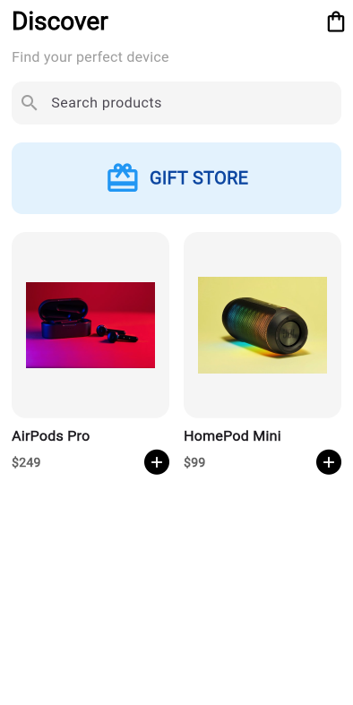
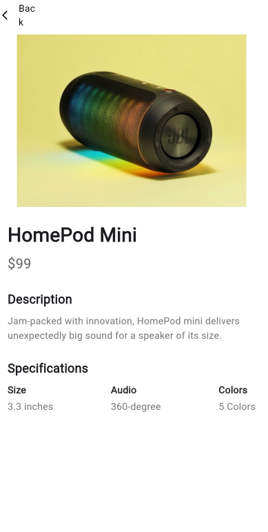
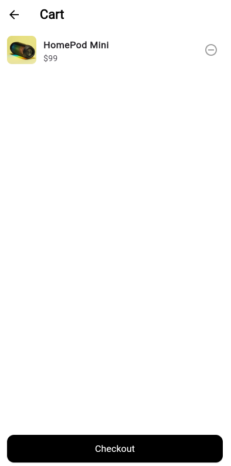

# Mini Katalog Uygulaması

## Kısa Açıklama
[cite_start]Bu proje, Flutter günlük eğitimi kapsamında geliştirilmiş "Mini Katalog Uygulaması"dır[cite: 4]. [cite_start]Projenin temel amacı; widget yapısı, sayfa geçişleri (Navigator), temel UI tasarımı, JSON benzeri veri modeli oluşturma ve doğru proje klasörleme mantığını uygulamalı olarak göstermektir[cite: 5]. [cite_start]Geliştirme sürecinde ekstra hiçbir dış paket kullanılmamış, sadece Flutter'ın varsayılan `material.dart` kütüphanesinden faydalanılmıştır[cite: 15, 16].

## Kullanılan Sürüm Bilgileri
* [cite_start]**SDK:** Flutter SDK [cite: 9] [cite_start]& Dart SDK [cite: 10]
* **Flutter Sürümü:** 3.41.4

## Çalıştırma Adımları
Projeyi bilgisayarınızda çalıştırmak için aşağıdaki adımları sırasıyla izleyiniz:

1. Terminal (veya komut satırı) üzerinden proje klasörünün içine girin:
   ```bash
   cd mini_katalog
Geliştirme aşamasında kullanılan test amaçlı görsellerin (Unsplash / Test API) tarayıcıdaki CORS (Çapraz Kaynak Paylaşımı) güvenlik politikalarına takılmadan yüklenebilmesi için projeyi web üzerinde aşağıdaki komutla başlatın:

Bash
flutter run -d chrome --web-browser-flag "--disable-web-security"
Uygulama Ekran Görüntüleri
1. Ana Sayfa (Discover)





2. Ürün Detay Sayfası





3. Sepet Sayfası (Cart)



